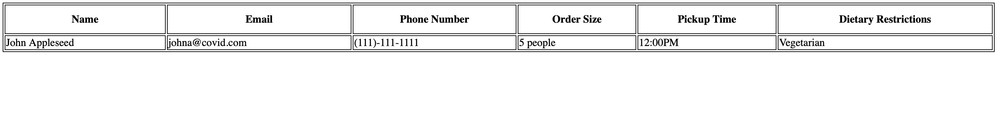

# covid19_suppORt
---
# TO DO 
1) Make user side model form that will interact with postgressql database 
---

Page fields:

Instructions to run:

Change directory to current folder open terminal and type:

pip install -r requirements.txt

python3 manage.py runserver

Go to your browser and open

http://127.0.0.1:8000/
